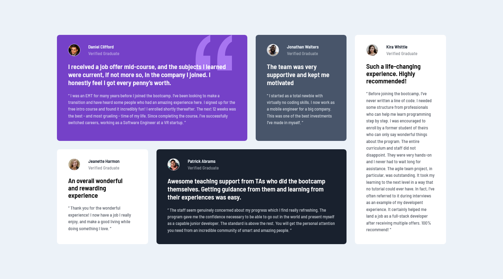

# Frontend Mentor - Testimonials grid section solution

This is a solution to the [Testimonials grid section challenge on Frontend Mentor](https://www.frontendmentor.io/challenges/testimonials-grid-section-Nnw6J7Un7). Frontend Mentor challenges help you improve your coding skills by building realistic projects.

## Table of contents

- [Overview](#overview)
  - [The challenge](#the-challenge)
  - [Screenshot](#screenshot)
  - [Links](#links)
- [My process](#my-process)
  - [Built with](#built-with)
  - [What I learned](#what-i-learned)
  - [Continued development](#continued-development)
  - [Useful resources](#useful-resources)
- [Author](#author)
- [Acknowledgments](#acknowledgments)

## Overview

### The challenge

Users should be able to:

- View the optimal layout for the site depending on their device's screen size

### Screenshot

### Links

- Solution URL: [Add solution URL here](https://your-solution-url.com)
- Live Site URL: [Add live site URL here](https://your-live-site-url.com)

## My process

### Built with

- Semantic HTML5 markup
- CSS custom properties
- Flexbox
- CSS Grid
- Mobile-first workflow

### What I learned

-I need to focus on which path should i use depending on css file not scss, because as i learned scss is a perprocessor that can only be compiled through css
-I need to work more on oraganizing my code (using BEM for the a next time)

### Continued development

I need to work more on organizing my code, even though Istarted to get used to saas and how to use the "@import"
I definetly need to give the BEM approche a try

### Useful resources

- [Youtube](https://www.youtube.com) - Youtube is a very hellpful recources for all developers, I mean you just need to tape your bug or where did you have an issue and a ton of tutorials will appear.
- [Stackoverflow](https://stackoverflow.com/) - This is the place where almost all the developers of the word meet, lot of them have experiences and are willing to help but also lot of them are just looking for help, So it's a great community and great resource for sure.

## Author

- Website - [Njoura7](https://github.com/Njoura7)
- Frontend Mentor - [@Njoura7](https://www.frontendmentor.io/profile/Njoura7)

## Acknowledgments

Those are my instractors that I am following right now and who are helping me in almost every single step and project:

### Youtube channels:

[_Kevin Powell_](https://www.youtube.com/kepowob)
In this project particularly I used [Kevin's video](https://www.youtube.com/watch?v=rg7Fvvl3taU&t=942s) as a main resource to understand some details and basics

[_Web Dev Simplified_](https://www.youtube.com/c/WebDevSimplified)

[_Traversy Media_ ](https://www.youtube.com/c/TraversyMedia)

[_Dave Gray_](https://www.youtube.com/c/DaveGrayTeachesCode)
